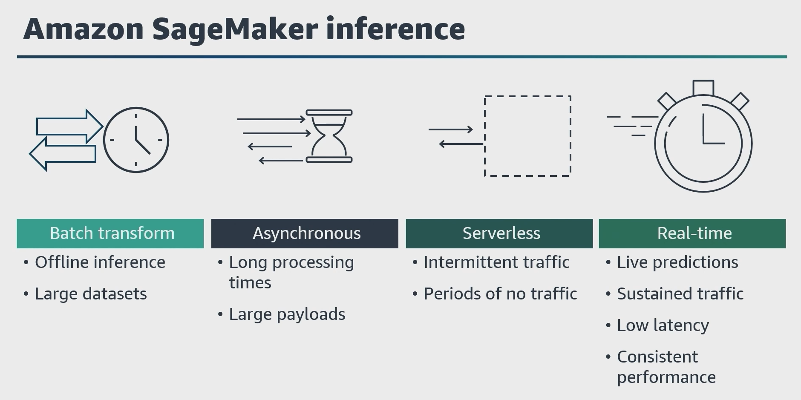
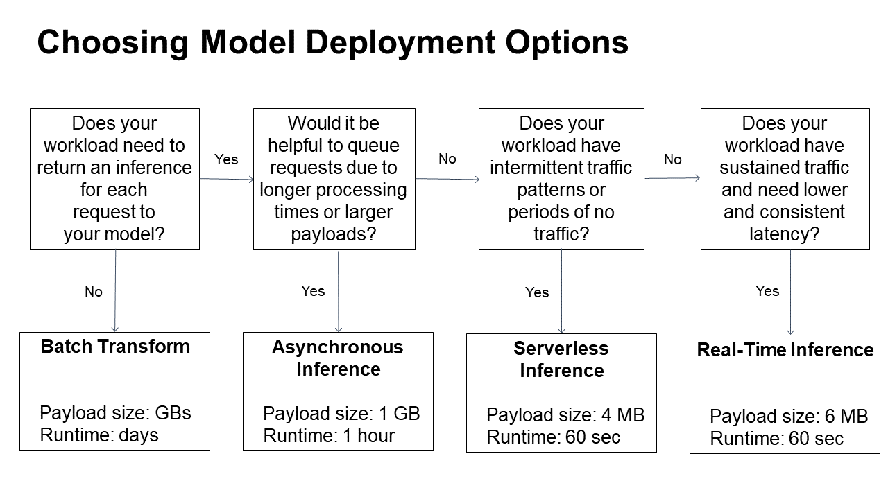

# 🧠 SageMaker AI Inference Options

SageMaker AI provides multiple inference options so that you can pick the option that best suits your workload:

---

## ⚡ Real-Time Inference
Real-time inference is ideal for **online inferences** that have **low latency** or **high throughput** requirements.  
Use real-time inference for a **persistent and fully managed endpoint (REST API)** that can handle sustained traffic, backed by the instance type of your choice.

- **Payload size**: up to 6 MB  
- **Processing time**: up to 60 seconds

:::tip
**Usage**: The real-time inference is ideal for inference workloads where you have real-time, interactive, low latency requirements. You can deploy your model to SageMaker hosting services and get an endpoint that can be used for inference. These endpoints are fully managed and support autoscaling.
:::

---

## ☁️ Serverless Inference
Serverless inference is ideal when you have **intermittent or unpredictable traffic patterns**.  
SageMaker AI manages all of the underlying infrastructure, so there’s **no need to manage instances or scaling policies**.  
You pay only for what you use and not for idle time.

- **Payload size**: up to 4 MB  
- **Processing time**: up to 60 seconds
:::tip
**Usage**: Used for workloads that have idle periods between traffic spikes and can tolerate cold starts.
:::

---

## 📥 Asynchronous Inference
Asynchronous inference is ideal when you want to **queue requests** and have **large payloads with long processing times**.  
Asynchronous Inference allows scaling down your endpoint to 0 when there are no requests to process.

- **Payload size**: up to 1 GB  
- **Processing time**: up to 1 hour

:::tip
**Usage**: Used for requests with large payload sizes up to 1GB, long processing times, and near real-time latency requirements.
:::

---

## 📦 Batch Transform (for inference)
Batch transform is suitable for **offline processing** when **large amounts of data** are available upfront and you **don’t need a persistent endpoint**.  
You can also use batch transform for **pre-processing datasets**.

- **Payload size**: 100MB of data  
- **Processing time**: can span multiple days

:::tip
**Usage**: To get predictions for an entire dataset.
:::
---

## SageMaker Inference

## Choosing Model Deployment Options

---