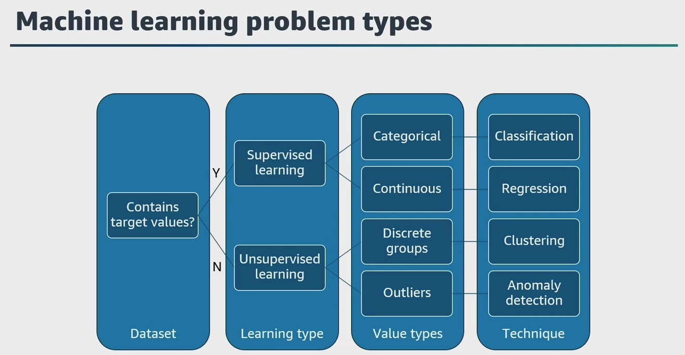

# Selecting the Right ML Techniques for Use Cases (Based on AWS Best Practices)

Machine learning problems are typically categorized as supervised (classification and regression), unsupervised (clustering, anomaly detection), and can involve techniques like linear/logistic regression or cluster analysis. Supervised learning uses labeled data to predict outcomes, while unsupervised learning discovers patterns in unlabeled data.

---

### Does Your Dataset Contain Target Values?
- If **Yes** → Use **Supervised Learning**
- If **No** → Use **Unsupervised Learning**

---

### Supervised Learning

Supervised learning applies when your dataset contains target values (labels) you want to predict. The type of values you want to predict determines the technique:

- **Categorical Target Values:**  
  Use **Classification** techniques.  
  - *Example*: Predicting whether an email is spam or not spam.
- **Continuous Target Values:**  
  Use **Regression** techniques.  
  - *Example*: Predicting the price of a house given its features.

---

### Unsupervised Learning

Unsupervised learning is used when your dataset does **not** contain labeled target values. Instead, the goal is to discover patterns or structure within the data:

- **Discrete Groups:**  
  Use **Clustering** techniques.  
  - *Example*: Segmenting customers into groups based on purchasing behavior.
- **Outliers (Anomalies):**  
  Use **Anomaly Detection** techniques.  
  - *Example*: Detecting unusual credit card transactions.

---

### Summary Table

| Dataset Contains Target? | Learning Type         | Value Type      | Technique         |
| ------------------------ | --------------------- | --------------- | ----------------- |
| Yes                      | Supervised Learning   | Categorical     | Classification    |
| Yes                      | Supervised Learning   | Continuous      | Regression        |
| No                       | Unsupervised Learning | Discrete Groups | Clustering        |
| No                       | Unsupervised Learning | Outliers        | Anomaly Detection |

---

**In summary**, ML techniques start with identifying whether the dataset has target labels. If so, supervised learning (classification or regression) is used. If not, unsupervised learning (clustering or anomaly detection) is appropriate, depending on whether you want to group data or find outliers.