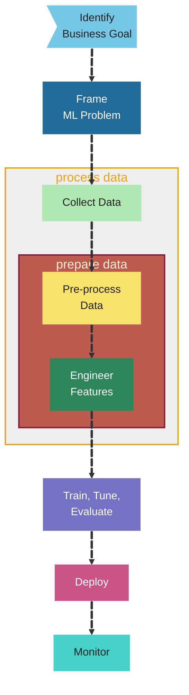

# Components of a Machine Learning (ML) Pipeline

A machine learning pipeline is a step-by-step process that organizes how an ML model is built, trained, tested, and deployed. It helps ensure your ML project is efficient, repeatable, and scalable.

Below are the common components in an ML pipeline:

---

## 📥 1. Data Collection

**What it is:**  
Gathering data from various sources such as databases, files, APIs, sensors, or user input.When collecting data for machine learning, you must determine whether the data is streaming or can be loaded in batches and set up an extract, transform, and load (ETL) process to gather data from multiple sources into a central repository. Because models need to be retrained regularly, your data collection process should be repeatable. It's also important to check if your data is labeled, as creating accurate labels can be time-consuming.

**Goal:**  
Get enough relevant data to train and test your model.

**Examples:**
- Sales data from a database
- Customer reviews from websites
- Sensor data from IoT devices

---

## 🧹 2. Data Pre-processing

**What it is:**  
Data pre-processing is the set of techniques used to clean, standardize, and prepare raw data before it’s used for analysis or modeling. It's important to address missing or anomalous values and to mask or remove any personally identifiable information (PII) during preprocessing.

**Goal:**  
Convert raw data into a clean, usable format.

**Tasks may include:**
- Removing missing or duplicate values
- Normalizing numeric features
- Converting text to lowercase
- Encoding categorical data (e.g., one-hot encoding)

---

## 📊 3. Exploratory Data Analysis (EDA)

**What it is:**  
Understanding the data by analyzing patterns, distributions, missing values, and outliers. Exploratory data analysis (EDA) using visualization and data wrangling tools helps you better understand and prepare data for model building. 

**Goal:**  
Detect problems and get insights about the structure of the data.

**Examples:**
- Viewing histograms or scatter plots
- Checking for correlations
- Finding missing or strange values

---

## 🛠️ 4. Feature Engineering

**What it is:**  
Selecting, creating, or transforming variables (features) used by the ML model.

**Goal:**  
Make the most useful data available to the model.

**Examples:**
- Combining “year” and “month” into a “season” feature
- Extracting text length from product reviews
- Creating a “days_since_last_purchase” column

---

## 🧠 5. Model Training

**What it is:**  
Feeding training data to an ML algorithm to learn patterns and create a predictive model.

**Goal:**  
Build a model that can make accurate predictions.

**Example Algorithms:**
- Linear regression
- Decision trees
- Neural networks

---

## ⚙️ 6. Hyperparameter Tuning

**What it is:**  
Adjusting the settings (hyperparameters) that control how the model learns.

**Goal:**  
Find the best configuration to improve performance.

**Examples:**
- Learning rate
- Number of decision tree branches
- Number of training epochs

---

## 📏 7. Model Evaluation

**What it is:**  
Testing the model on unseen (test) data to measure how well it performs.

**Goal:**  
Know if the model is accurate, fair, and useful.

**Common Metrics:**
- Accuracy
- Precision and recall
- Mean squared error (MSE)
- Area under the ROC curve (AUC)

---

## 🚀 8. Model Deployment

**What it is:**  
Making the trained model available for real use in applications.

**Goal:**  
Enable others (or systems) to send data to the model and get predictions.

**Deployment Methods:**
- Real-time API (e.g., using AWS SageMaker endpoints)
- Batch processing
- Edge devices (mobile, IoT)

---

## 📡 9. Model Monitoring

**What it is:**  
Tracking the model’s performance after deployment to make sure it still works well.

**Goal:**  
Detect and fix issues like data drift, bias, or performance drops.

**Monitoring Can Include:**
- Prediction accuracy over time
- Latency and response time
- Alerting when something unusual happens

---

## 🧭 Summary Flow

Data Collection → Data Pre-processing → EDA → Feature Engineering → Model Training → Hyperparameter Tuning → Model Evaluation → Deployment → Monitoring

This complete cycle is often repeated as new data becomes available or business needs change.

---

## 🧰 AWS Tools for Each Step

| Pipeline Step             | AWS Tool(s)                                      |
| ------------------------- | ------------------------------------------------ |
| Data Collection           | AWS Glue, Amazon S3, AWS Data Wrangler           |
| Data Pre-processing       | AWS Glue, SageMaker Processing Jobs              |
| Exploratory Data Analysis | Amazon SageMaker Studio, Jupyter Notebooks       |
| Feature Engineering       | SageMaker Feature Store                          |
| Model Training            | Amazon SageMaker Training Jobs                   |
| Hyperparameter Tuning     | Amazon SageMaker Automatic Model Tuning          |
| Model Evaluation          | SageMaker Experiments                            |
| Deployment                | SageMaker Endpoints, Lambda, ECS, SageMaker Edge |
| Monitoring                | SageMaker Model Monitor, CloudWatch              |

