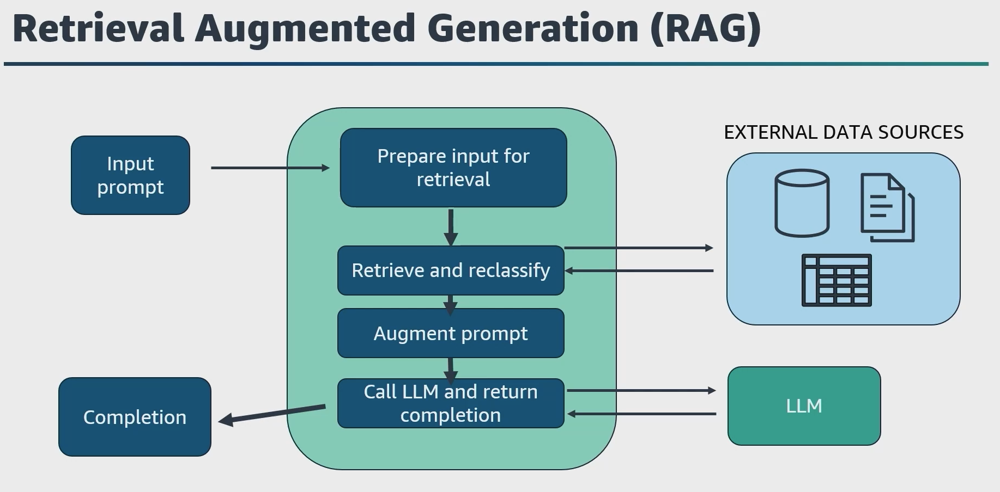

# 🔎 Retrieval-Augmented Generation (RAG)

## 📖 What is RAG?

**Retrieval-Augmented Generation (RAG)** is an AI architecture that enhances the output of large language models (LLMs) by combining two components:

1. **Retriever**:  
   - Searches a **knowledge base** (typically a **vector database**) to find relevant context.
   - Uses **semantic search** by embedding your input query and comparing it with stored vector embeddings.

2. **Generator**:  
   - The LLM takes both your **original prompt** and the **retrieved context** to generate a response.
   - The augmented prompt helps produce more accurate and context-specific answers.

---

## 🔍 Why Use RAG?

LLMs can hallucinate—generate factually incorrect but confident-sounding answers—because they rely only on their pre-trained data.  
**RAG solves this** by enriching the model with **external, up-to-date, and domain-specific knowledge**.

---

## 🧠 How RAG Works (Step-by-Step)

1. A user inputs a **prompt** (question or instruction).
2. The prompt is **embedded** using a query encoder into a vector.
3. The vector is sent to a **vector database** (e.g., OpenSearch, pgvector).
4. The **retriever** searches and returns **similar embeddings** (documents or passages).
5. The original prompt + retrieved context = **augmented prompt**.
6. This augmented prompt is sent to the **generator model (LLM)**.
7. The **LLM generates a response** using both the original input and retrieved knowledge.

---

## 💼 Business Applications of RAG

### ✅ 1. **Question Answering Systems**

- Use internal documents or manuals to answer employee/customer queries with accuracy.

### ✅ 2. **Customer Support Bots**

- Provide precise, company-specific answers without retraining the model.

### ✅ 3. **Search Augmentation**

- Replace keyword search with **semantic search** for better information retrieval.

### ✅ 4. **Enterprise Knowledge Assistants**

- Train assistants on company SOPs, policy documents, or internal wikis.

### ✅ 5. **Content Generation**

- Use RAG to create reports, summaries, or marketing material with factual backing.

---

## 🛠️ Beyond RAG: Agents in Amazon Bedrock

- **Agents** extend RAG by orchestrating multi-step tasks (e.g., booking, data updates).
- Can **call APIs**, **ingest structured data**, and **generate custom logic**.
- Perfect for task automation like making a **scuba diving reservation** or processing a **purchase order**.

---

## 🚀 Summary

| Concept          | Description                                                     |
| ---------------- | --------------------------------------------------------------- |
| **RAG**          | Combines retrieval + generation to enhance accuracy and context |
| **Retriever**    | Finds relevant knowledge using vector similarity                |
| **Generator**    | LLM produces output using retrieved knowledge                   |
| **Business Use** | Improves chatbots, search, Q&A, and automated workflows         |
| **AWS Tools**    | Amazon Bedrock, OpenSearch, pgvector, RDS, Redis, Agents        |