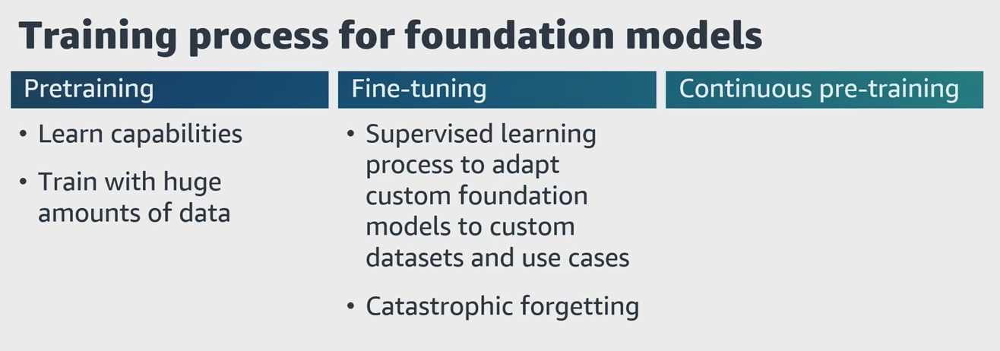

# 🧠 Key Elements of Training a Foundation Model

Training a foundation model involves three main stages:

## 1. Pre-training

- **Purpose**: Teach the model general capabilities and understanding of human language and multimodal data.
- **Method**:  
  - Uses **self-supervised learning**  
  - Trained on vast amounts of **unstructured data** (text, images, audio, etc.)
- **Requirements**:  
  - Trillions of tokens  
  - Petabytes of data  
  - Millions of GPU compute hours  
  - Significant trial and error
- **Outcome**:  
  The model learns fundamental patterns and representations but is not specialized for specific tasks or domains.

---

## 2. Fine-tuning

- **Purpose**: Adapt the pre-trained model to **specific tasks** or **domains**.
- **Method**: Uses **supervised learning** with **labeled datasets** to update the model's weights.
- **Key Variants**: Instruction tuning, domain adaptation, parameter-efficient fine-tuning (PEFT)
- **Consideration**: Risk of **catastrophic forgetting** when training on single tasks.

---

## 3. Continuous Pre-training

- **Purpose**: Extend the model’s training with **new general data** to improve generalization or keep it up to date.
- **Method**:  
  Continues the original pre-training process, often on a broader or refreshed dataset.
- **Benefit**:  
  Enhances the model’s foundational knowledge without focusing on a specific task or domain.

---

Each stage builds upon the previous one — from general understanding (**Pre-training**) to task specialization (**Fine-tuning**) to refinement and updates (**Continuous Pre-training**).
