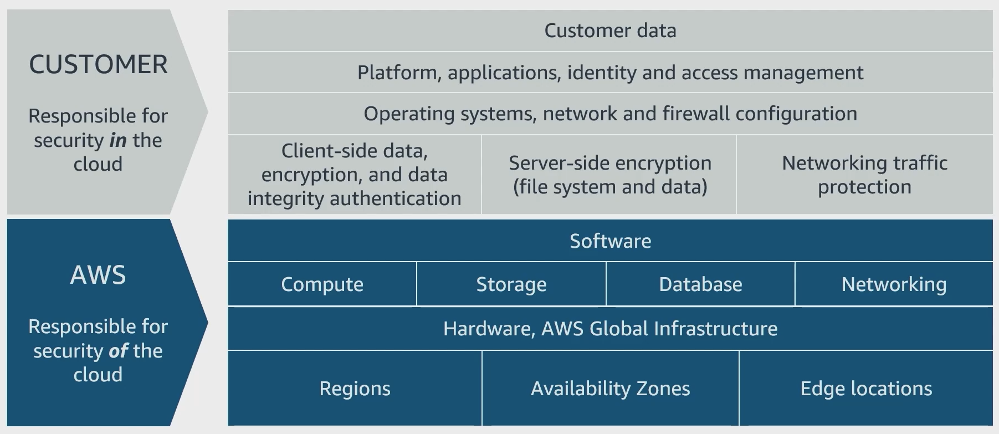

# AWS Services and Features to Secure AI Systems

## AWS Shared Responsibility Model

**What it is:**  
A core principle that defines **who secures what** in the cloud.

- **AWS responsibilities:** Protect **the cloud** — data centers, physical hardware, networking, and the global infrastructure (Regions, Availability Zones, buildings).
- **Customer responsibilities:** Secure **what’s in the cloud** — properly configure services, manage data privacy, control access, use encryption, and follow best practices.

**Why it matters for AI:**  
When deploying AI models, you must handle your **application-level security** (e.g., patch models, secure training data) while AWS protects the underlying infrastructure.

<em>Source: AWS Documentation</em>

---

## IAM (Identity and Access Management)

**What it is:**  
A **web service** to manage **who can access your AWS AI resources** and **what actions they can perform**.

**Key features:**

- **IAM Users:** Individual identities (name + credentials) to access AWS.
- **IAM Roles:** Identities you assign to apps or AWS services (e.g., SageMaker notebooks can assume a role to access S3 securely).
- **Policies & Permissions:** Rules to allow or deny actions for users, roles, or groups.
- **MFA (Multifactor Authentication):** Extra security layer beyond passwords.

**Best practice:**  

- Use **roles** for AI workloads instead of hard-coded keys.
- Follow **least privilege** — only grant permissions needed to run or train your AI.

---

## Encryption

**What it is:**  
Protect your AI training data, model artifacts, and predictions by encrypting them.

**How AWS helps:**  

- Tools to encrypt data **in transit** and **at rest**.
- Option to manage your own keys or use AWS-managed keys.

**Example:**  
Encrypt S3 buckets storing training data, or use SageMaker’s built-in encryption.

---

## Amazon Macie

**What it is:**  
A **security service** that uses ML to **discover, classify, and protect sensitive data** stored in AWS.

**Use for AI:**  
If you store customer data for training, Macie helps detect **Personally Identifiable Information (PII)** and alerts you so you can enforce tighter controls or encryption.

---

## AWS PrivateLink

**What it is:**  
A service to **securely access AWS services over private network connections**, avoiding the public internet.

**Use for AI:**  
Deploy models (e.g., on SageMaker) and serve predictions **privately within your VPC**, reducing exposure to external threats.

---

## Key Takeaway

To secure an AI system on AWS:

- **Rely on AWS to protect the cloud infrastructure.**
- **Use IAM for secure access control.**
- **Encrypt data and models.**
- **Monitor and classify sensitive info with Macie.**
- **Use PrivateLink for private connections.**

Together, these help you **fulfill your responsibilities under the Shared Responsibility Model** while benefiting from AWS’s robust security foundation.
